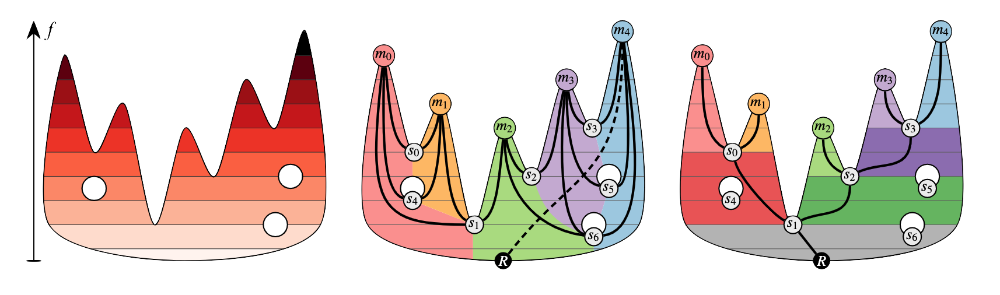
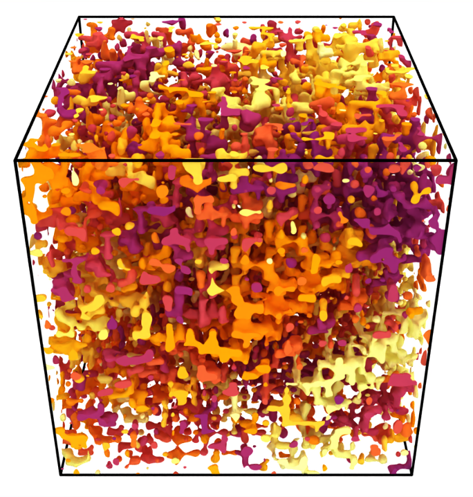

A representative image of how to use path compression for fast segmentation ([Paper](/publication/2024-08-21-Distributed-Path-Compression)):

An example of how to use extremumgraphs for augmented merge tree computation([Paper](/publication/2023-01-01-ExTreeM-Scalable-Augmented-Merge-Tree-Computation-via-Extremum-Graphs)):

A render of the morse-smale complex:

Using the morse-smale complex for data segmentation and extraction:

Using path compression for computing connected components ([Paper](/publication/2024-08-21-Distributed-Path-Compression)):
